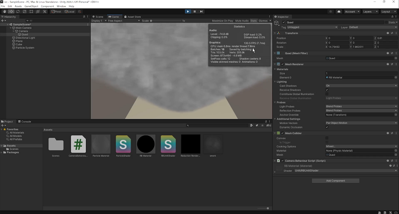

# 縮小バッファ

* 縮小バッファにパーティクルを表示してみよう
* 前回のグレアや被写界深度を縮小バッファで実装してみよう

# 自分なりに変更した点

-
-
-

# 進め方

- 本リポジトリをフォークしてください
- フォークしたリポジトリをcloneします
- Unityのプロジェクトを更新して実装してください。
- このテキストファイルに変更点を記載してください
- result.gifを自分の結果を保存して差し替えてください
- プルリクエストを出して提出してください
